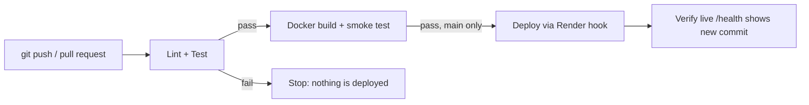

# Self Profile Website

A personal profile website for **Soham Dalvi** (about me, interests, projects and resume) with a visitor **guestbook**.
Every page is generated by an Express server from the data in `data/profile.js`, and the guestbook form adds new data through a POST request.

- **Live site:** https://YOUR-SERVICE.onrender.com
- **Pipeline:** https://github.com/YOUR-USERNAME/self-profile-website/actions

## Features

| Route | Method | What it does |
|---|---|---|
| `/` | GET | Home page: about, interests, projects, guestbook |
| `/resume` | GET | Printable resume page |
| `/messages` | POST | Adds a guestbook message (validated; 400 on bad input, 302 redirect on success) |
| `/api/profile` | GET | Full profile as JSON |
| `/api/projects` | GET | Projects as JSON |
| `/api/messages` | GET | Guestbook messages as JSON |
| `/health` | GET | `{"status":"ok","commit":"abc1234"}` |
| anything else | GET | 404 page |

The footer shows the commit ID that is currently deployed (`RENDER_GIT_COMMIT` on Render, `GIT_SHA` in Docker, `local` on a laptop).
Guestbook messages are stored in memory, so they reset when the server restarts.

## Run locally

```bash
npm install
npm run lint
npm test
npm start        # http://localhost:3000
```

With Docker:

```bash
docker build -t self-profile .
docker run -p 3000:3000 self-profile
```

## Project structure

```
self-profile-website/
├── .github/workflows/ci-cd.yml   # CI/CD pipeline
├── data/profile.js               # all my profile content
├── views/                        # functions that build the HTML pages
│   ├── layout.js                 # shared header, footer and HTML escaping
│   ├── home.js
│   ├── resume.js
│   └── notFound.js
├── public/                       # style.css and favicon.svg
├── test/app.test.js              # automated tests (node:test)
├── app.js                        # routes and validation
├── server.js                     # starts the server on PORT
├── Dockerfile
├── eslint.config.js
└── package.json
```

## CI/CD pipeline



1. **lint-and-test** runs ESLint and the `node:test` suite on every push and pull request.
2. **build** (`needs: lint-and-test`) builds the Docker image, starts it and checks `/health`.
3. **deploy** (`needs: build`, push to `main` only) calls the Render deploy hook stored in the `RENDER_DEPLOY_HOOK` secret, passing the exact commit that passed.
4. **verify** polls the live `/health` until it reports the new commit.

If any stage fails, every later stage is skipped, so broken code never reaches the live site.
